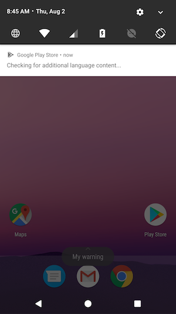
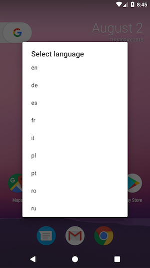

# Language Switcher Tile
Quick settings tile that allows you to easily change your device language.





### Installation

1. Import Language Switcher tile to your app.
2. Use LanguageSwitcherTile.Builder to enable tile with specified configuration. 
3. Install the app on your device.
4. Grant CHANGE_CONFIGURATION permission using following method:

```
adb shell pm grant com.azimo.sendmoney.languagetiletileplugin android.permission.CHANGE_CONFIGURATION
```

### How to use

Open the quick settings panel, edit it and drop language switcher tile into it. When language switcher tile is enabled click on it and allow it to modify system settings. Now you can change your device language in two ways:

1. Click language switch tile to select next language from a list of supported languages.
2. Long click language switch tile to open supported languages dialog and select language.

If you attached a warning while enabling tile you should see it displayed in toast message after language selection. Now, you can expand quick settings panel to see selected language shortcut under Language Switcher Tile icon.

## License

    Copyright (C) 2018 Azimo

    Licensed under the Apache License, Version 2.0 (the "License");
    you may not use this file except in compliance with the License.
    You may obtain a copy of the License at

       http://www.apache.org/licenses/LICENSE-2.0

    Unless required by applicable law or agreed to in writing, software
    distributed under the License is distributed on an "AS IS" BASIS,
    WITHOUT WARRANTIES OR CONDITIONS OF ANY KIND, either express or implied.
    See the License for the specific language governing permissions and
    limitations under the License.